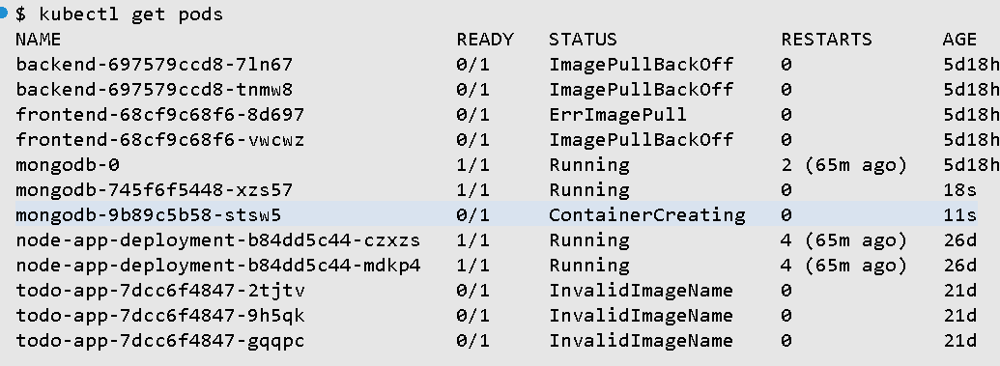
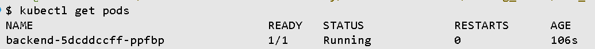
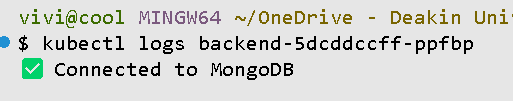
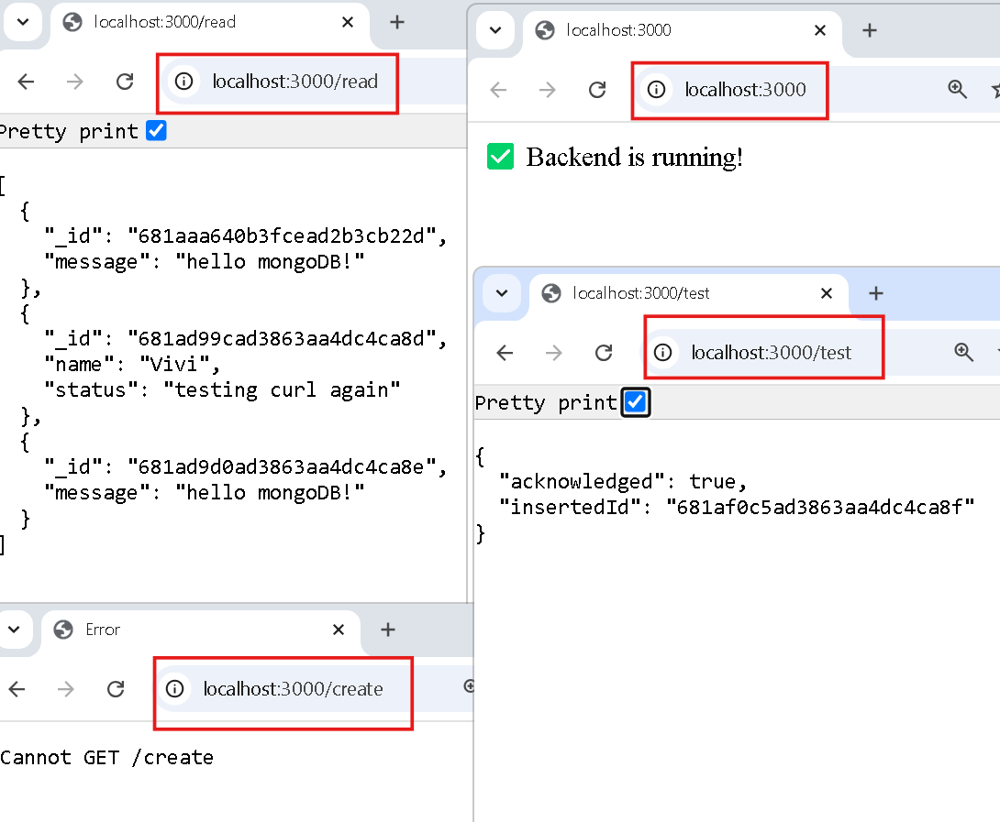

# 9.1P: Adding a Database to a Containerized Microservice

**overview**

When building an app, you need a place to save and update data. Microservices (small parts of an app) need this too. This task, focuses on **connecting a MongoDB database** to a containerized microservice running in Kubernetes.

Tools Used

- **Docker** – containerised the Node.js application
- **Docker Hub** – hosted the backend image
- **Kubernetes (kubectl)** – deployed MongoDB and backend, managed resources
- **MongoDB** – used as the database
- **Node.js + Express** – built the backend service
- **MongoDB Shell (mongo)** – created database user and tested access
- **curl** – tested API endpoints (`/`, `/create`, `/read`)

# 1. Install MongoDB into Kubernetes Cluster

Deploy a standalone MongoDB instance in your Kubernetes environment so your app can store data.

Steps:

- Create a MongoDB Deployment (runs MongoDB inside Kubernetes)
- Create a MongoDB Service (enables other apps to access it)

**Basic YAML Setup (Standalone MongoDB)**

1. **Create a file named `mongodb-deployment.yaml`**:

   ```yaml
   apiVersion: apps/v1
   kind: Deployment
   metadata:
     name: mongodb
   spec:
     replicas: 1
     selector:
       matchLabels:
         app: mongodb
     template:
       metadata:
         labels:
           app: mongodb
       spec:
         containers:
           - name: mongodb
             image: mongo:5.0
             ports:
               - containerPort: 27017
   ```

   1. **Create a file named `mongodb-service.yaml`**:

   ```yaml
   apiVersion: v1
   kind: Service
   metadata:
     name: mongodb
   spec:
     selector:
       app: mongodb
     ports:
       - port: 27017
         targetPort: 27017
   ```

   Open Bash terminal and apply commands:

   ```yaml
   kubectl apply -f mongodb-deployment.yaml
   kubectl apply -f mongodb-service.yaml
   ```

Once applied, MongoDB runs in your cluster and is accessible internally through the service name `mongodb`.

---

# 2. **Create a MongoDB user in Kubernetes**

Add a MongoDB user (e.g., `appuser`) with a password and permission to access a specific database.

1. **Access MongoDB pod**

   Find pod name:

   ```bash
   kubectl get pods
   ```

   Look for a name like `mongodb-xxxxx.`

   Connect to the pod:

   ```bash
   kubectl exec -it <your-mongodb-pod-name> -- bash
   ```

   

2. Open the Mongo Shell

   ```bash
   mongo
   ```

3. Switch to Your App’s Database

   ```bash
   use mydatabase
   ```

4. Create a New User

   ```json
   db.createUser({
     user: "appuser",
     pwd: "password123", // Replace with a strong password
     roles: [ { role: "readWrite", db: "mydatabase" } ]
   })
   ```

Explanations:

- `"mydatabase"` = your application’s database.
- `"appuser"` = your new username
- `"readWrite"` – user can read and write data in mydatabase.
- **Success message**: `{ "ok" : 1 }` means the user was created correctly.

---

# 3. **Configure persistent storage** for MongoDB (PV & PVC)

Without persistent storage, MongoDB data is lost every time the pod restarts. Using a **Persistent Volume (PV)** and **Persistent Volume Claim (PVC)** keeps the data safe across restarts or crashes.

**What’s the difference?**

- **PV (Persistent Volume):** The _actual_ storage space in the cluster (like a USB drive plugged in).
- **PVC (Persistent Volume Claim):** A _request_ for part of that space (e.g., “I need 1GB from that USB”).

Think of it as giving MongoDB **its own external 1GB storage** that survives restarts.

1.  Create the PV file, named `mongodb-pv.yaml`:

```yaml
apiVersion: v1
kind: PersistentVolume
metadata:
  name: mongodb-pv
spec:
  capacity:
    storage: 1Gi
  accessModes:
    - ReadWriteOnce
  hostPath:
    path: /data/db
```

This sets aside 1GB of space on the host machine.

2.  Create the PVC file, called `mongodb-pvc.yaml`:

```yaml
apiVersion: v1
kind: PersistentVolumeClaim
metadata:
  name: mongodb-pvc
spec:
  accessModes:
    - ReadWriteOnce
  resources:
    requests:
      storage: 1Gi
```

This claims the 1GB storage for MongoDB.

1. Apply the files:

   ```yaml
   kubectl apply -f mongodb-pv.yaml
   kubectl apply -f mongodb-pvc.yaml
   ```

1. Mount the volume in your MongoDB Deployment

   In your `mongodb-deployment.yaml`:

   **Under `containers:` → `volumeMounts:`**

   ```yaml
   volumeMounts:
     - name: mongodb-storage
       mountPath: /data/db
   ```

   At the bottom of the pod spec:

   ```yaml
   volumes:
     - name: mongodb-storage
       persistentVolumeClaim:
         claimName: mongodb-pvc
   ```

---

# **4. Create a Kubernetes Secret for MongoDB**

Hardcoding passwords in YAML files is risky. A **Secret** lets you store sensitive info (like username/password) securely.

1. Encode credentials in Base64

```bash
echo -n 'appuser' | base64
echo -n 'password123' | base64
```

output:

```bash
YXBwdXNlcg==      # base64 for "appuser"
cGFzc3dvcmQxMjM=  # base64 for "password123"
```

1. Create the secret file, `mongodb-secret.yaml`:

```yaml
apiVersion: v1
kind: Secret
metadata:
  name: mongodb-secret
type: Opaque
data:
  mongo-user: YXBwdXNlcg== # base64 for "appuser"
  mongo-password: cGFzc3dvcmQxMjM= # base64 for "password123"
```

---

# 5. Update your app deployment to connect to MongoDB

Create a file called `backend-deployment.yaml` and configure environment variables to connect securely to MongoDB using the secret.

```yaml
apiVersion: apps/v1
kind: Deployment
metadata:
  name: backend
spec:
  replicas: 1
  selector:
    matchLabels:
      app: backend
  template:
    metadata:
      labels:
        app: backend
    spec:
      containers:
        - name: backend
          image: your-backend-image:latest
          imagePullPolicy: Never
          ports:
            - containerPort: 3000

          # Use for the mongodb secret
          env:
            - name: MONGO_USER
              valueFrom:
                secretKeyRef:
                  name: mongodb-secret # secret file name "mongodb-secret.yaml"
                  key: mongo-user # base64 key for MongoDB username
            - name: MONGO_PASSWORD
              valueFrom:
                secretKeyRef:
                  name: mongodb-secret # secret file name "mongodb-secret.yaml"
                  key: mongo-password # base64 key for MongoDB password
            - name: MONGO_DB
              value: mydatabase # your MongoDB database name
            - name: MONGO_HOST
              value: mongodb # service name to access MongoDB inside cluster
```

Apply the updated deployment:

```bash
kubectl apply -f backend-deployment.yaml
```

---

# 6. Configure the application to connect to MongoDB

1. Create `app.js` file:

```jsx
const uri = `mongodb://${process.env.MONGO_USER}:${process.env.MONGO_PASSWORD}@${process.env.MONGO_HOST}:27017/${process.env.MONGO_DB}?authSource=${process.env.MONGO_DB}`;
const { MongoClient } = require("mongodb");

const client = new MongoClient(uri);

async function connectDB() {
  try {
    await client.connect();
    console.log("✅ Connected to MongoDB");
  } catch (err) {
    console.error("❌ MongoDB connection error:", err);
  }
}

connectDB();
```

Create `Dockerfile`

```jsx
# Use Node.js base image
FROM node:18-slim

# Set the working directory
WORKDIR /app

# Copy package file
COPY package*.json ./

# Install dependencies
RUN npm install

# Copy the rest of your app
COPY . .

# Run the app
CMD ["node", "app.js"]
```

Install dependencies:

```jsx
npm init -y
npm install express mongodb
```

### Publish Docker Image

1. Go to Docker Hub

- **Repository name**: `backend-mongodb`
- **Visibility**: `Public`
- Click **Create**

1. Log in if access is denied:

```bash
docker login -u your-email@gmail.com
```

1. Tag and push your image:

```docker
docker tag backend:latest your-username/backend-mongodb:latest
docker push your-username/backend-mongodb:latest
```

### Check if the Backend Container is Running

```docker
kubectl get pods
```

This backend container now running.


Check logs and confirm MongoDB connection:

```docker
kubectl logs <backend-pod-name>
```

MongoDB connection is worked.



---

# 7. **Test the deployment with basic CRUD** (Create, Read, Update, Delete)

1. Add test route in `app.js`

```jsx
const express = require("express");
const { MongoClient } = require("mongodb");
const app = express();
const port = 3000;

const uri = `mongodb://${process.env.MONGO_USER}:${process.env.MONGO_PASSWORD}@${process.env.MONGO_HOST}:27017/${process.env.MONGO_DB}?authSource=${process.env.MONGO_DB}`;
const client = new MongoClient(uri);

app.use(express.json());

// health  check
app.get("/", (req, res) => {
  res.send("✅ Backend is running!");
});

// Test MongoDB connection and insert
app.get("/test", async (req, res) => {
  try {
    await client.connect();
    const db = client.db(process.env.MONGO_DB);
    const result = await db
      .collection("test")
      .insertOne({ message: "hello mongoDB!" });
    res.send(result);
  } catch (err) {
    res.status(500).send("MongoDB insert failed: " + err.message);
  }
});

app.get("/create", (req, res) => {
  res.send("POST only");
});

// CREATE
app.post("/create", async (req, res) => {
  try {
    await client.connect();
    const db = client.db(process.env.MONGO_DB);
    const result = await db.collection("test").insertOne(req.body);
    res.send(result);
  } catch (err) {
    res.status(500).send("Create failed: " + err.message);
  }
});

// READ
app.get("/read", async (req, res) => {
  try {
    await client.connect();
    const db = client.db(process.env.MONGO_DB);
    const result = await db.collection("test").find({}).toArray();
    res.send(result);
  } catch (err) {
    res.status(500).send("Read failed: " + err.message);
  }
});

app.listen(port, () => console.log(`Listening on port ${port}`));
```

2. Rebuild and push Docker image

```jsx
docker build -t backend:latest .
docker tag backend:latest vivicool/backend-mongodb:latest
docker push vivicool/backend-mongodb:latest
```

3. Restart Backend Pod in Kubernetes

```docker
kubectl delete pod -l app=backend
```

This forces Kubernetes to pull your updated image and restart the pod.

It now connected Node.js to MongoDB



---

# Monitor MongoDB and Application Performance

Ensure your backend and database are running correctly over time.

## Tools Used:

- `kubectl logs <pod-name>` — check MongoDB and backend logs for health and issues.
- `curl <http://localhost:3000/read`> — Test if the backend can read data from MongoDB.

## Monitoring Steps:

- Ran `kubectl logs` to check for errors or connection issues.
- Used `curl` to verify the backend is responding and fetching data properly.

## Example Commands

```bash
# Check pod status
kubectl get pods

# View logs from MongoDB and backend pods
kubectl logs <mongodb-pod-name>
kubectl logs <backend-pod-name>

# Test if app is running and responding
curl <http://localhost:3000/>
curl <http://localhost:3000/read>
```
